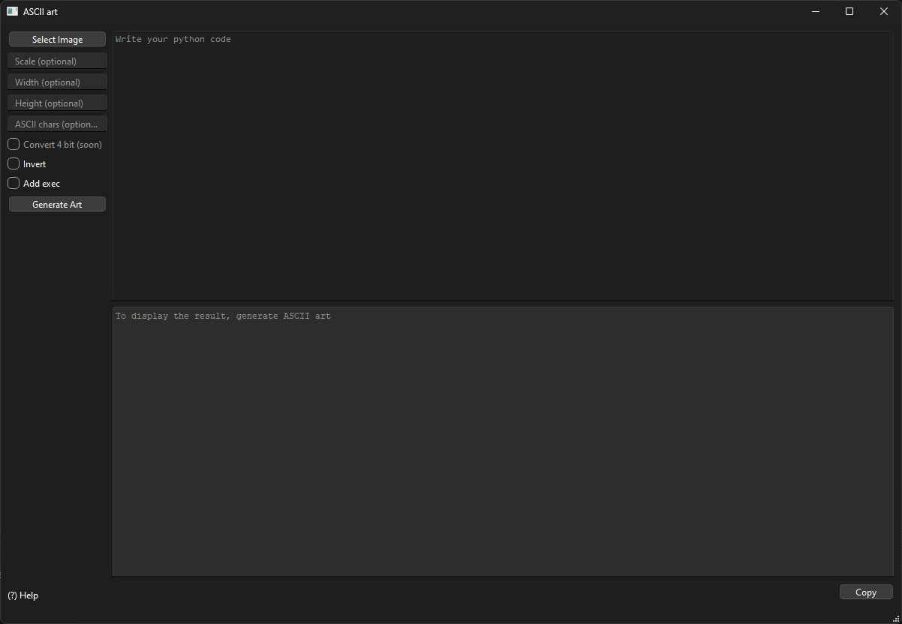
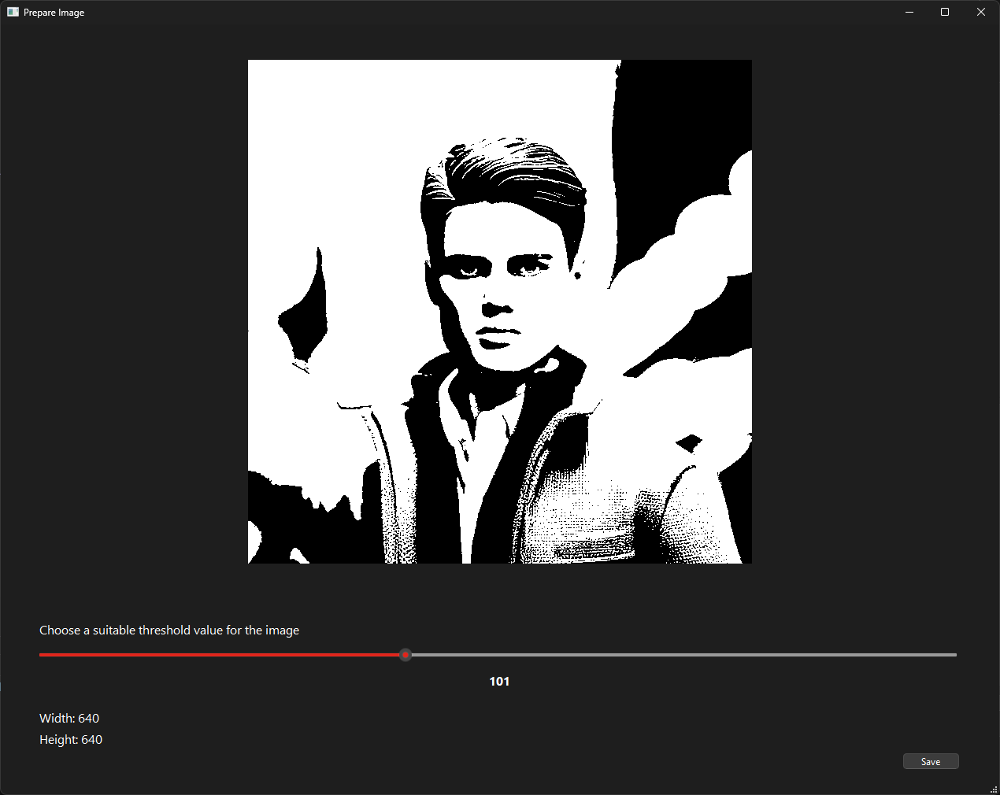
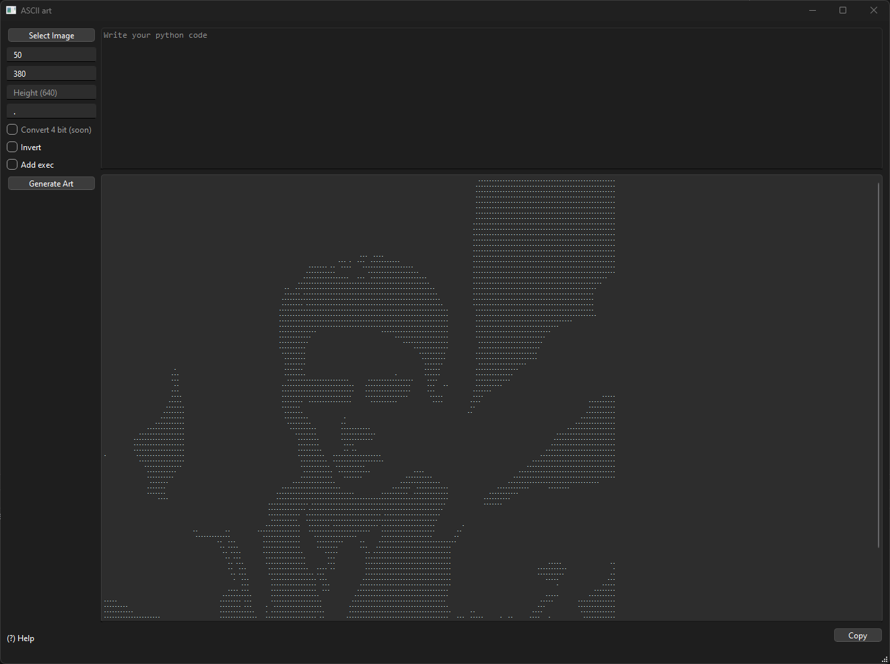
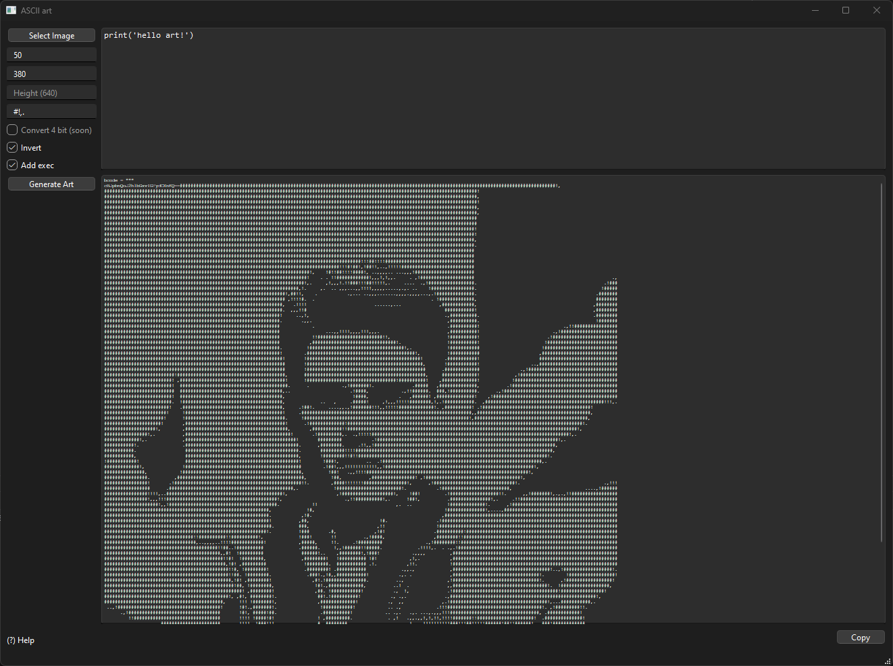
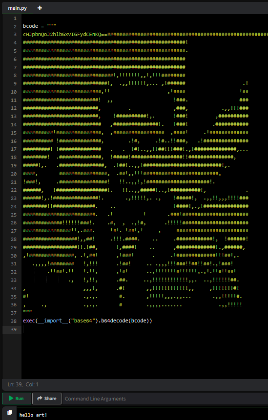

# 🌅 ASCII Art Generator <sup>version 1.0</sup>

## 📃 Описание проекта
Позволяет преобразовывать изображения в ASCII-арт + добавлять пользовательский код на Python. Проект предоставляет графический интерфейс, разработанный с использованием PySide6. 
- Зачем это нужно ?
- Для развлечения !

## 🙌 Возможности
1. **Выбор изображения:** выбирайте изображения (`Select Image`) формата `.jpg` или `.png`
   


3. **Настройка порога:** регулируйте порог для лучшего преобразования изображения в черно-белый формат и уточнению деталей



4. **Изменение размеров:** можно настроить общий размер (`scale`), ширину (`width`) и высоту (`height`) арта



5. **Инвертирование:** инвертируйте цвета (`Invert`) для получения альтернативного вида арта



6. **Набор символов:** составляйте свои наборы символов (`ASCII chars`) для создания уникального стиля


7. **Добавление кода Python:** Вы можете встраивать свой Python код (`Add exec`) прямо в ASCII-арт!



## ⬇️ Установка
1. Клонировать репозиторий

``` 
$ https://github.com/dfluppy/pycode-to-ascii-art.git
```

2. Установить зависимости
   
```
$ pip install -r requirements.txt
```

3. Запустить приложение
   
```
$ python main.py
```
---
###### ✪ This is not the final version of the program
